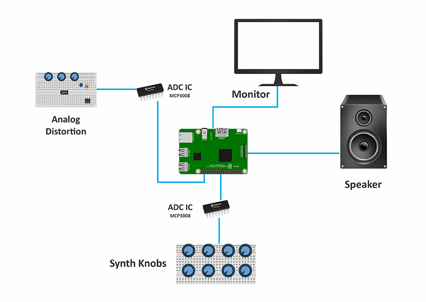

# HybSynth

## Introduction

**HybSynth** is a simple Raspberry-Pi audio synthesizer with various modules and audio effects written in Python.
Most of the synthesizers made by enthusiasts or audio companies are completely analog or completely digital or software-based. But I decided to take a different approach to make a hybrid synthesizer. Although the main core of this project is written in Python and implemented on Raspberry-Pi development board, I've made the **distortion** audio effect completely analog, using op-amps and passive electronic components. You can change the parameters of the synthesizer and the distortion effect using knobs and buttons on the HybSynth.

HybSynth has two separate wave generators which generate the main audio waves, one LFO generator, a mixer, an audio effect unit with vibrato, tremolo, delay and an analog distortion unit.
HybSynth uses two MCP3008 ADC ICs, responsible for converting the potentiometer analog values to digital GPIO pins of the Raspberry-Pi. A monitor or LCD module is attached to the board via an HDMI cable, on which we can see the parameter values of the modules in real-time. Finally, there is a couple of amplified loudspeakers, as audio output for hearing the results.

## The modules of HybSynth

### 1. Oscillators & LFO Module

**Main Oscillators:** Two basic waveform generator modules, each one capable of generating Sine wave, Square wave, Triangle wave and Sawtooth wave, with ability to change the amplitude (volume) and frequency (pitch) of the waves. Every set of oscillator has one rotary switch for choosing between the waveforms and two potentiometers for changing the frequency and amplitude of the generated waveform.

**LFO Generator:** LFO unit also has two knobs for changing the frequency and amplitude.

### 2. Mixer

**Two-channel mixer:** The two main audio signals combine in the mixer.
**Pan:** A pan knob is embedded in the mixer to determine how much of each signal can pass through.

### 3. Audio Effects

**Vibrato**: Vibrato is generated when an audio signal or a music note changes pitch subtly and quickly. The vibrato unit has two knobs to change the maximum deviation of the frequency and the rate of the vibrato in Hz.

**Tremolo**: Tremolo is an effect that creates a change in volume. The effect has two knobs, one two determine the maximum deviation of the amplitude and one to determine the rate of the tremolo in Hz.

**Delay:** The delay unit has two knobs. One to change the delay time of the effect in seconds and one to change the amount of delay fed back into the input. The delay time is the time between the original sound and the repeated sound and feedback is the amount of the repeated sound added back into the original sound. The more feedback added, the more the sound will repeat and the more it will build up. The less feedback, the less the sound will repeat and the less it will build up. The delay unit also has a knob to change the mix of the effect. The mix knob determines how much of the original sound and how much of the repeated sound is heard.

**Analog distortion:** The distortion unit is completely analog, using op-amps and passive electronic components. The distortion unit has a knob to change the amount of distortion applied to the audio signal.

## Hardware 

You can find all the necessary components, the schematics and setup tutorials here: [HybSynth Hardware](/tutorials/hybsynth_hardware.md)

## Software

